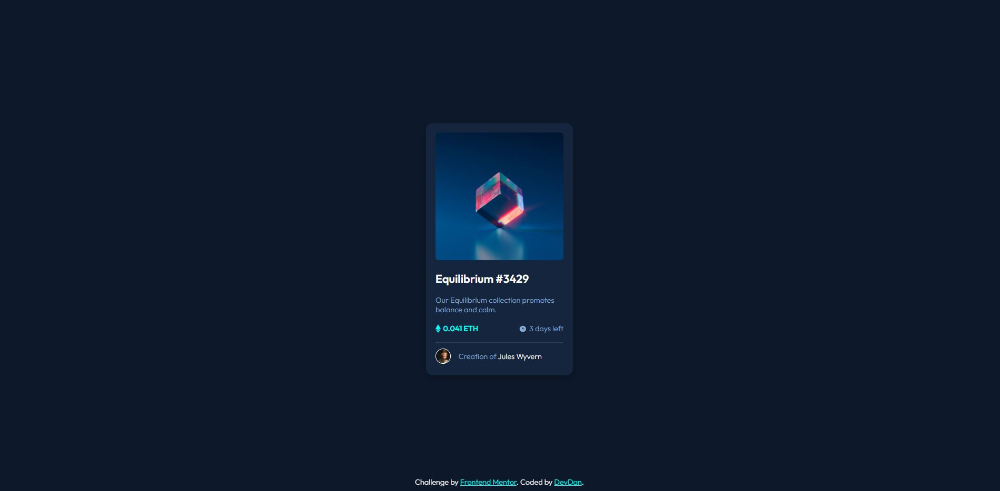

# Frontend Mentor - NFT preview card component solution

This is a solution to the [NFT preview card component challenge on Frontend Mentor](https://www.frontendmentor.io/challenges/nft-preview-card-component-SbdUL_w0U). Frontend Mentor challenges help you improve your coding skills by building realistic projects.

## Table of contents

- [Overview](#overview)
  - [The challenge](#the-challenge)
  - [Screenshot](#screenshot)
  - [Links](#links)
  - [Built with](#built-with)
  - [What I learned](#what-i-learned)
- [Author](#author)
- [Acknowledgments](#acknowledgments)

## Overview

### The challenge

Users should be able to:

- View the optimal layout depending on their device's screen size
- See hover states for interactive elements

### Screenshot

### Links

- Solution URL: [Add solution URL here](https://your-solution-url.com)
- Live Site URL: [Add live site URL here](https://your-live-site-url.com)

### Built with

- Semantic HTML5 markup
- CSS custom properties
- Flexbox
- Mobile-first workflow

### What I learned

This was a particularly challenging task for me however it was still fun with a sense of accomplishment once it was done.

I approached this project with a pen and a piece of paper. First drawing it out and visualising it by breaking the different elements down into sections. This gave me a better sense of how to approach this challenge.
Once in Visual studio I started off with the necessary boilerplate and links (fonts & CSS)

Styling the elements was pretty simple with the addition of span elements I've made use of to get the desired colour result.

Once I got to the ethereum section I ran into my first hurdle where the icons and text weren't lining up, horizontally. Playing around with a solution I eventually came to figure out that flexbox - align items: center worked for me.
My next hurdle was creating the overlay for the main image. I've never done this before so it was new to me and took a bit of research to figure out.
W3schools was where I found my solution.
[Image overlay tutorial] (https://www.w3schools.com/howto/tryit.asp?filename=tryhow_css_image_overlay_fade)

Instead of copy/pasting the solution. I tried to understand what exactly it meant and was doing to get a better understanding of how it worked. It was fairly simple to implement in my code and it gave me a smile once I figured it out.

Overall I am happy with the result however I am concerned with the amount of code that is used to produce the result.
I'm sure there are much better ways to write efficient code. Are there any areas where I can improve on this within my current code? I would love to hear your thoughts and suggestions.

DevDan

## Author

- Frontend Mentor - [@DevDan21](https://www.frontendmentor.io/profile/DevDan21)
- Twitter - [@doubedan6](https://twitter.com/DoubleDan6)
